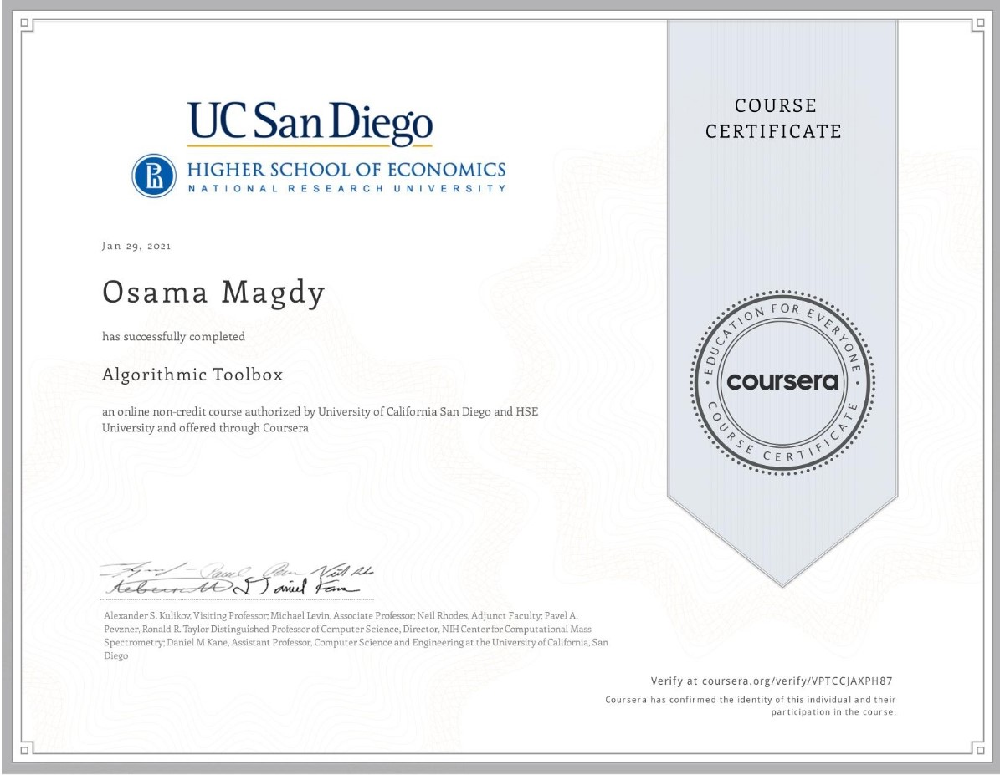

# ⚡ Algorithmic-Toolbox
This is my solutions for the first Course of <a href="https://www.coursera.org/specializations/data-structures-algorithms">Data Structures and Algorithms Specialization</a> on Coursera by the University of California San Diego and HSE University. Solutions are written in C++ language and doesn't use any external dependencies.

<h3 align="center">Algorithmic Toolbox</h3>

 

# About the Course
The course covers basic algorithmic techniques and ideas for computational problems arising frequently in practical applications: sorting and searching, divide and conquer, greedy algorithms, dynamic programming.

We will learn a lot of theory: how to sort data and how it helps for searching; how to break a large problem into pieces and solve them recursively; when it makes sense to proceed greedily; how dynamic programming is used in genomic studies. You will practice solving computational problems, designing new algorithms, and implementing solutions efficiently (so that they run in less than a second).

# 🎆🦾Certificate of compilation
